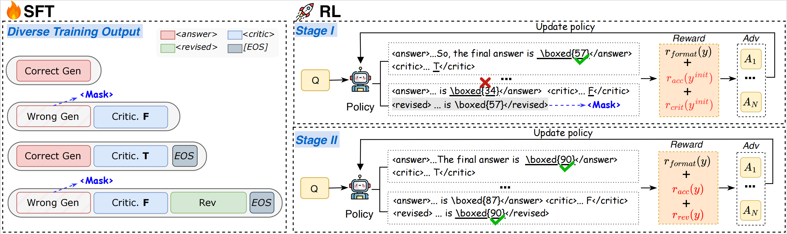

<h1 align="center">🧠 Structured Reasoning for Large Language Models</h1>

<div align="center"> 

[](./figs/SCR_v3.pdf)
[]() 

</div>

**SCR** is a framework that decouples reasoning trajectories into explicit, evaluable, and trainable components. We mainly implement it using a *Generate–Verify–Revise* paradigm. 

Specifically, we construct structured training data and apply Dynamic Termination Supervision to guide the model in deciding when to terminate reasoning. To avoid interference between learning signals for different reasoning abilities, we adopt a progressive two-stage reinforcement learning strategy: the first stage targets initial generation and self-verification, and the second stage focuses on revision.

<div align=center>
    
</div>

## SFT Phase
### Install Dependencies

```bash
conda create -n SCR-SFT python=3.10.9
conda activate SCR-SFT
cd LLaMA-Factory
pip install -e .
```
### ▶️Run
```bash
bash run_SCR-SFT.sh
```

| Parameter     | Description                                                                                                                                                              |
| ------------- | ------------------------------------------------------------------------------------------------------------------------------------------------------------------------ |
| `model_path`  | Path to the base language model. This is the model you fine-tune during training. 
| `template`   | Template for the model.|                                                     |
| `dataset`   | Path to the training dataset. Please revise the _EOS_ token according to the model type.

## RL Phase
### Install Dependencies
```bash
conda create -n SCR-RL python=3.10.9
conda activate SCR-RL
cd EasyR1
pip install -e .
```
### ▶️Run
```bash
# Stage I: 
bash run_SCR-Stage1.sh

# Stage II:
bash run_SCR-Stage2.sh
```

## Evaluation
```bash
bash infer.sh
```

## 🎉Acknowledgements

This repository includes code adapted from the following open-source projects:

- **LLaMA-Factory**: https://github.com/hiyouga/LLaMA-Factory
- **EasyR1**: https://github.com/hiyouga/EasyR1/

We thank the authors and contributors of these projects for making their code publicly available. 
